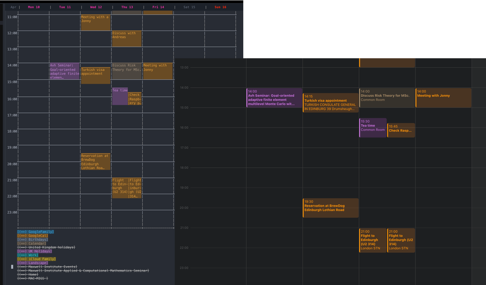

#+title: maccalfw.el - Calendar view for Mac Calendars
#+author: Al Haji-Ali
#+language: en
#+export_file_name: maccalfw.texi
#+texinfo_dir_category: Emacs misc features
#+texinfo_dir_title: maccalfw: (maccalfw).
#+texinfo_dir_desc: Extensions and application menus based on transient

This package provides a list of commands to be able to fetch, add, modify and
remove events to Apple's Calendar app.

* Installation
=maccalfw= can be installed with the following =use-package= command, assuming
that you have straight installed.
#+begin_src emacs-lisp
  (use-package maccalfw
    :commands maccalfw-open
    :straight (:host github
                     :repo "haji-ali/maccalfw"
                     :files ("*.el" ("src" . "src") "Package.swift")))
#+end_src

You will need the Swift toolchain (=swift=) installed, which =maccalfw.el=
uses to build the =maccalq= helper (via =swift build=) the first time it
is needed.

Emacs must also have access to your Apple Calendars and Reminders, which means
that you will need to add the following to Emacs' =Info.plist= (for example
inside =/Applications/Emacs.app/Contents/Info.plist=) somewhere inside the
outer =<dict>= tag

#+begin_src xml
  <key>NSCalendarsUsageDescription</key>
  <string>Emacs requires permission to access the calendar for maccalfw.el to work.</string>
  <key>NSRemindersUsageDescription</key>
  <string>Emacs requires permission to access reminders for maccalfw.el to work.</string>
#+end_src

and restart Emacs so that when =maccalq= requests access you will be
shown a permission dialog that you can approve.

* Configuration
There's no further configuration needed. You can call =maccalfw-open= to open
a =week= view of the calendar using =calfw=.

* Standalone use
The =maccalq= binary this package builds (=.build/release/maccalq= inside the
package's repo) is a general-purpose command-line tool for querying and
editing Calendar/Reminders events -- it doesn't depend on Emacs and can be
used on its own. Run =maccalq --help= for its commands and arguments.

This is how my calendar looks vs my Apple's calendar.

#+caption: Calendar comparison

If you want to recreate a similar parity with Apple's calendar then you may
want to use my fork [[https://github.com/haji-ali/calfw-blocks][calfw-blocks]].
